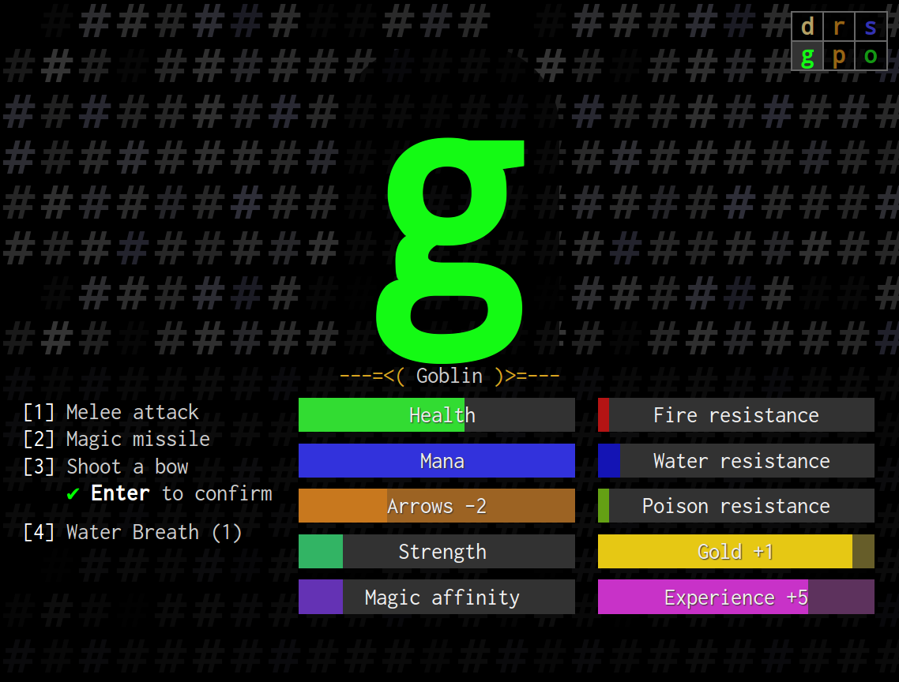

# Warden's Duty

This is a [7DRL](http://7drl.org/) game. To play it, just open http://ondras.github.io/wardens-duty/ in your browser.

## Technology

HTML, CSS (LESS), JavaScript (ES6). To build, just `make`. To build continually, do `make watch` -- this requires `inotify-tools`.

Two custom fonts are used:

 - Inconsolata for the general UI,
 - Droid Sans Mono for individual critters and other dungeon features.
